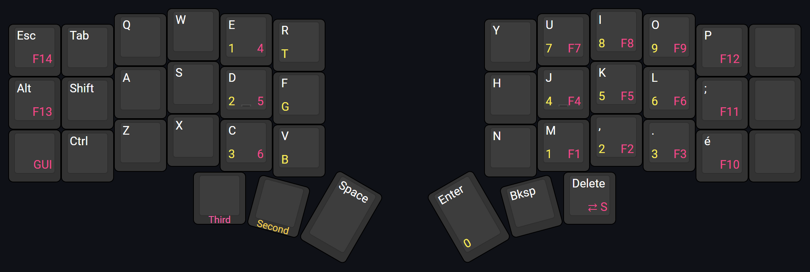

# kevinpastor's zmk-config

This is my personal [ZMK firmware](https://github.com/zmkfirmware/zmk/) configuration. It consists of a 42-keys base layout that is used for my Corne keyboard.

## Highlights

- Keymap for Canadian French Windows layout using helper macros from
  [zmk-nodefree-config](https://github.com/urob/zmk-nodefree-config)
- Gaming layers crafted for FPS games
- Symbol layer based off [Pascal Getreuer's article](https://getreuer.info/posts/keyboards/symbol-layer/index.html)
- ["Timer-less" homerow mods](#timeless-homerow-mods)

## Layers

### Standard Layers

*Layout preview generated on [keyboard-layout-editor.com](http://www.keyboard-layout-editor.com/#/gists/14c5c6b4de6c618dfc265b5b77a0cff0)*

The overall design of the standard layers has been greatly influenced by the gaming layers. The reasoning behind this is to keep the same muscle memory across both groups of layers.

Some macros have been used for symbols because of an issue when using Windows RDP with the keyboard over Bluetooth.

#### Alpha Layer

The alpha layer is based on the Colemak-DH layout. The position of symbols on that layer has been influenced by their usage frequency in both French and English according to [an article from Wikipedia](https://en.wikipedia.org/wiki/English_punctuation) and [an article from bépo](https://bepo.fr/wiki/Fr%C3%A9quence_des_caract%C3%A8res). Controls and whitespace keys have been placed according to their usage and their usual position on a standard keyboard.

Homerow mods are active for that layer.

#### Symbols Layer

The symbols layer as been greatly inspired by [an article by Pascal Getreuer](https://getreuer.info/posts/keyboards/symbol-layer/index.html). The main difference is the mirroring of its layer to ensure inward rolls are possible for the `{`, `}`, `(`, `)`, `[`, and `]` keys.

Homerow mods are always active for that layer.

#### Numbers Layer

The numbers layer has been designed to simply mimic the numpad on a standard keyboard. A comma was added to support French decimal numbering notation.

Homerow mods are always active for that layer to support key combination as `CTRL + 1`.

#### Miscellaneous Layer

The miscellaneous layer has been designed to provide extra keys like arrows and French accents. The arrows have been placed on the home row to avoid hand movement. Since the left hand is often used for movement in games using WASD, the position of the up arrow has been decided according to the usual finger on the W key (i.e. the middle finger). Accents have been placed on a row according to their frequency in French.

#### Functions Layer

The functions layer has been designed to resemble the numbers layer as close as possible. Numbers past 9 were placed in regards to ergonomics.

The `F13` and `F14` keys have been made available to use as dedicated mute and deafen shortcuts on Discord. They are position and accessed exactly the same on the gaming layers.

### Gaming Layers

*Layout preview generated on [keyboard-layout-editor.com](http://www.keyboard-layout-editor.com/#/gists/9b497751bc9a9fc18a86e876f723288d)*

To avoid having to remap every game because of Colemak-DH layout, the gaming layers are setup with QWERTY. The catch: the lefthand side is shifted right by one key to center the navigation keys (WASD) on the home row keys. This leads to better ergonomy at the expense of key compromises: some alpha keys are repositioned on another layer.

To go to the gaming layers (G) from the standard layers, hold the leftmost thumb key and then tap the rightmost thumb key. To go back to the standard layers (S), hold the leftmost thumb key and then tap the rightmost thumb key, same as the other way around.

### References

- [Colemak Mod-DH](https://colemakmods.github.io/mod-dh/)
- [Designing a Symbol Layer by Pascal Getreuer](https://getreuer.info/posts/keyboards/symbol-layer/index.html)
- [ShelZuuz's symbol layer](https://www.reddit.com/r/ErgoMechKeyboards/comments/1ch1ubl/comment/l20p2e2/)
- [DreymaR's Big Bag of Kbd Tricks](https://dreymar.colemak.org/)
- [Miryoku](https://github.com/manna-harbour/miryoku)
- [urob's configuration](https://github.com/urob/zmk-config)
