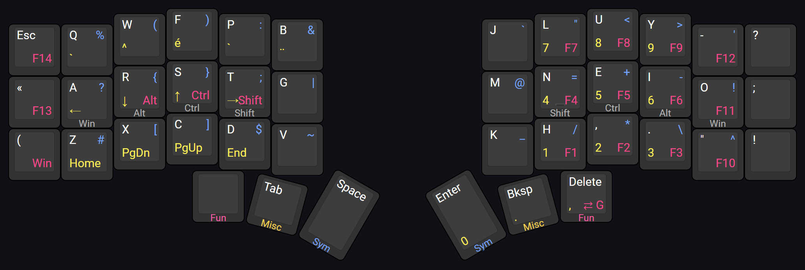

# kevinpastor's zmk-config

This is my personal [ZMK firmware](https://github.com/zmkfirmware/zmk/) configuration. It consists of a 42-keys base layout that is used for my Corne keyboard.

## Highlights

- Keymap for Canadian French Windows layout using helper macros from
  [zmk-nodefree-config](https://github.com/urob/zmk-nodefree-config)
- Gaming layers crafted for FPS games
- Symbol layer based off [Pascal Getreuer's article](https://getreuer.info/posts/keyboards/symbol-layer/index.html)
- ["Timer-less" homerow mods](#timeless-homerow-mods)

## Layers

### Standard Layers

*Layout preview generated on [keyboard-layout-editor.com](http://www.keyboard-layout-editor.com/#/gists/14c5c6b4de6c618dfc265b5b77a0cff0)*

The Colemak-DH layout is used on the alpha layer. The position of the symbols on that layer has been influenced by their usage frequency in both French and English according to [an article from Wikipedia](https://en.wikipedia.org/wiki/English_punctuation) and [an article from bépo](https://bepo.fr/wiki/Fr%C3%A9quence_des_caract%C3%A8res).

Apart from that, the overall design of the standard layers has been greatly influenced by the gaming layers. The reasoning behind this is to keep the same muscle memory across both groups of layers.

Some macros have been used for symbols because of an issue when using Windows RDP with the keyboard over Bluetooth.

### Gaming Layers

*Layout preview generated on [keyboard-layout-editor.com](http://www.keyboard-layout-editor.com/#/gists/9b497751bc9a9fc18a86e876f723288d)*

To avoid having to remap every game because of Colemak-DH layout, the gaming layers are setup with QWERTY. The catch: the lefthand side is shifted right by one key to center the navigation keys (WASD) on the home row keys. This leads to better ergonomy at the expense of key compromises: some alpha keys are repositioned on another layer.

To go to the gaming layers (G) from the standard layers, hold the leftmost thumb key and then tap the rightmost thumb key. To go back to the standard layers (S), hold the leftmost thumb key and then tap the rightmost thumb key, same as the other way around.
