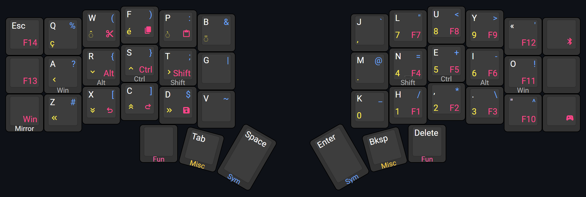

# kevinpastor's zmk-config

This is my personal [ZMK firmware](https://github.com/zmkfirmware/zmk/) configuration. It consists of a 42-keys base layout that I use for my Corne keyboard.

## Features

- Integrates [the nice!view Elemental module](https://github.com/kevinpastor/nice-view-elemental) for custom display;
- Has gaming layers crafted for FPS games;
- Implements [urob's "timer-less" home row mods](https://github.com/urob/zmk-config);
- Provides mirrored layers to complement mouse usage;
- Built for the Canadian French Windows layout;
- Uses helper macros from
  [zmk-nodefree-config](https://github.com/urob/zmk-nodefree-config).

## Layers

### Standard Layers

*Layout preview generated on [keyboard-layout-editor.com](http://www.keyboard-layout-editor.com/#/gists/14c5c6b4de6c618dfc265b5b77a0cff0)*

The overall design of the standard layers has been greatly influenced by the gaming layers described below. The reasoning behind this is to keep the same muscle memory across both groups of layers.

Home row mods are setup to use the right variant of the modifiers on the right hand side to allow to switch hand if the modifier was pressed using a finger on the wrong hand. The right hand side `Alt` is the exception to this to avoid having `AltGr` registered with the Canadian French Windows layout.

The Canadian French Windows layout must be used in order for the symbols and some other characters to register properly.

#### Alpha Layer

The alpha layer is based on the Colemak-DH layout. Controls and whitespace keys have been placed according to their usage and their usual position on a standard keyboard.

Extra punctuation keys where initially laid out on the outward columns, but this caused more hesitation than to use them from the symbols layer instead.

Home row mods are active for that layer.

#### Symbols Layer

The symbols layer has been greatly inspired by [an article by Pascal Getreuer](https://getreuer.info/posts/keyboards/symbol-layer/index.html). The main difference is the mirroring of its layer to ensure inward rolls are possible for the `{`, `}`, `(`, `)`, `[`, and `]` keys.

Home row mods are active for that layer.

#### Miscellaneous Layer

The miscellaneous layer is designed to provide numbers as well as extra keys like arrows and French accents. 

On the right side, the numbers have been placed to mimic the numpad on a standard keyboard. A comma was added to support French decimal numbering notation. The `0` key was initially placed on the thumb but caused issues with combos, hence its current position.

The arrows have been placed on the home row to avoid hand movement. Since the left hand is often used for movement in games using WASD, the position of the up arrow has been decided according to the usual finger on the W key (i.e. the middle finger). The `Home`, `Page Down`, `Page Up`, and `End` keys were placed following the same general idea, right underneath.

Accents are placed on a row according to their frequency in French.

Home row mods are only active on the right hand for that layer. This allows long press of the arrow keys. 

#### Functions Layer

The functions layer is designed to resemble the numbers layer as close as possible. Function keys past `F9` were placed in regards to ergonomics.

The `F13` and `F14` keys are available as dedicated mute and deafen shortcuts on Discord. They are positioned and accessed exactly the same on the gaming layers.

A Bluetooth management key is made available on that layer to cycle through profiles or to clear the current one when the `Shift` key is held.

Home row mods are not active for that layer. Instead, the left hand side provides the modifier keys "as is" to be able to access them instantly without having to wait for the home row mods timeout. This is useful for side-scrolling with `Shift` and the scroll wheel or for zooming on a page with `Ctrl` and the scroll wheel.

### Gaming Layers

*Layout preview generated on [keyboard-layout-editor.com](http://www.keyboard-layout-editor.com/#/gists/9b497751bc9a9fc18a86e876f723288d)*

To avoid having to remap every game because of Colemak-DH layout, the gaming layers are set up with QWERTY. The catch: the left-hand side is shifted right by one key to center the navigation keys (WASD) on the home row keys. This leads to better ergonomics at the expense of key compromises: some alpha keys are repositioned on another layer.

To switch to the gaming layers (G) from the standard layers, hold the leftmost thumb key and tap the rightmost thumb key. Repeat the same action to return to the standard layers (S).

## References

- [Colemak Mod-DH](https://colemakmods.github.io/mod-dh/)
- [Designing a Symbol Layer by Pascal Getreuer](https://getreuer.info/posts/keyboards/symbol-layer/index.html)
- [ShelZuuz's symbol layer](https://www.reddit.com/r/ErgoMechKeyboards/comments/1ch1ubl/comment/l20p2e2/)
- [DreymaR's Big Bag of Kbd Tricks](https://dreymar.colemak.org/)
- [Miryoku](https://github.com/manna-harbour/miryoku)
- [urob's configuration](https://github.com/urob/zmk-config)

## Changelog

### 2025-04-15

- Replaced the dedicated Bluetooth profile keys by one that cycles through them.
- Created all mirror layers.
- Added the `#` key to the gaming layers.

### 2025-02-25

- Created a mirrored alpha layer
    - Having the right-hand side keys available on the left-hand side is useful when doing operations that require the mouse (e.g. moving the mouse cursor and then pressing Enter).
    - The position of the mirror key is reused on other layers, so mirroring and then entering a layer leads to the same result as entering a layer and then mirroring.

### 2024-10-31

- Moved the gaming layer toggle key and the Bluetooth profile selection keys on the other hand.
    - Having the left pinky memorize 6 different actions became problematic in games when F13 was searched, but the key on the other layer was tried instead.

### 2024-10-17

- Replaced key presses on the thumb keys on layers with momentary layer behaviors.
    - Nested taps could occur when two characters from different layers were pressed consecutively (e.g., a number followed by a symbol, where the first layer change overlapped the second layer change).

### 2024-10-16

- The gaming layers change key and the Bluetooth behaviors were moved a bit more out of the way 
- Added macros for common use cases.
    - The "cédille" accent in French is exclusively used on the letter c, which made sense to remove the dedicated accent key and replace it with a "c cédille" key.
    - Undo and redo are shortcuts often used but a bit awkward to do with the home row mods.
